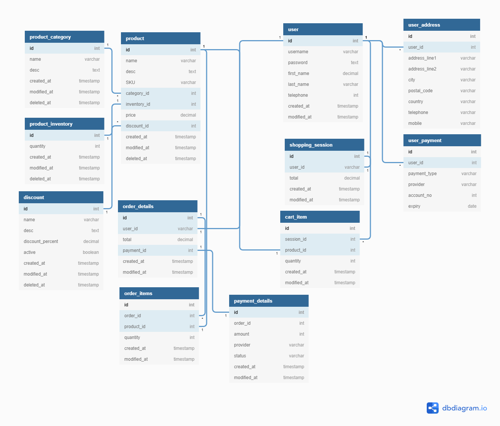

# Ecommerce Web Application with Django

description goes here...

### Prequesties

- There are some default libraries need to be installed for django like "Pellow"

### Ecommerce Data Schema

Source Link: https://resources.fabric.inc/blog/answers/ecommerce-database-design-example
